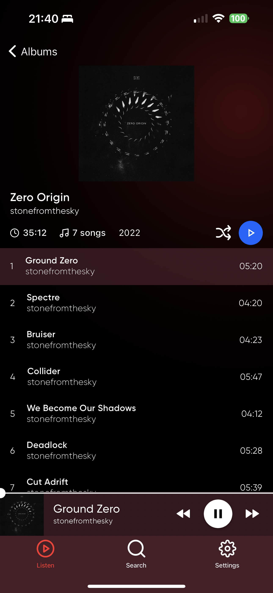
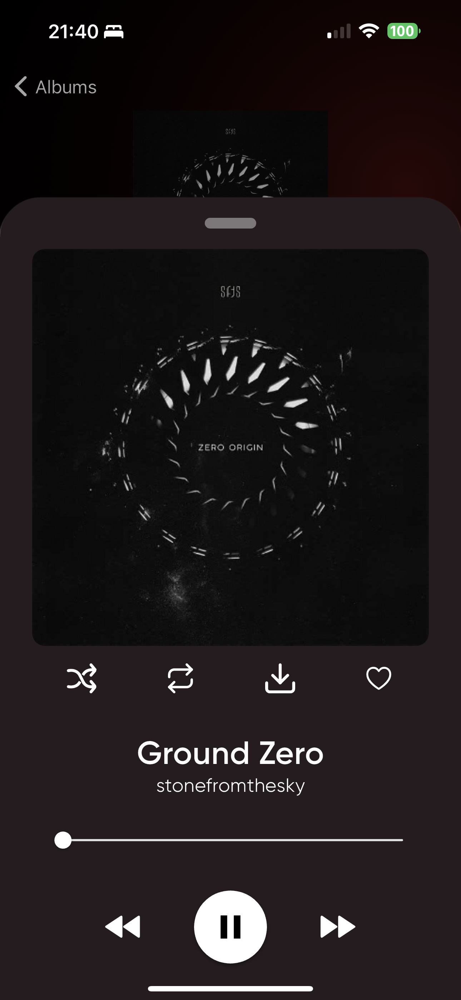
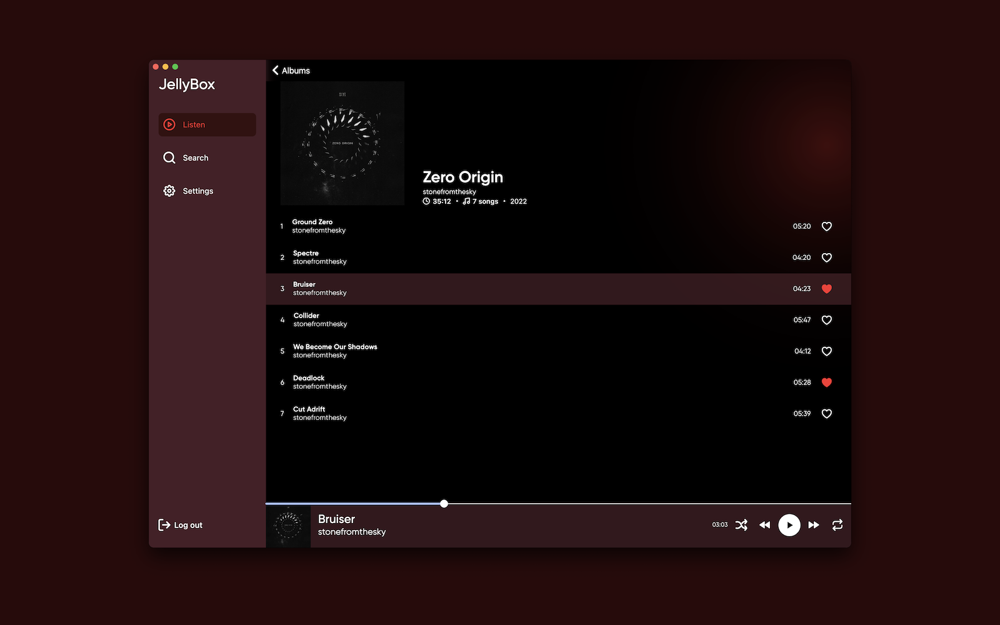
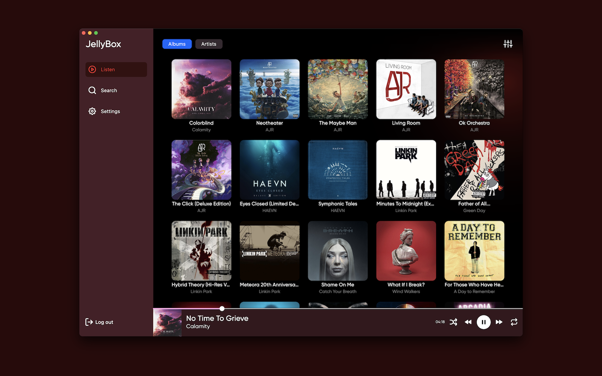
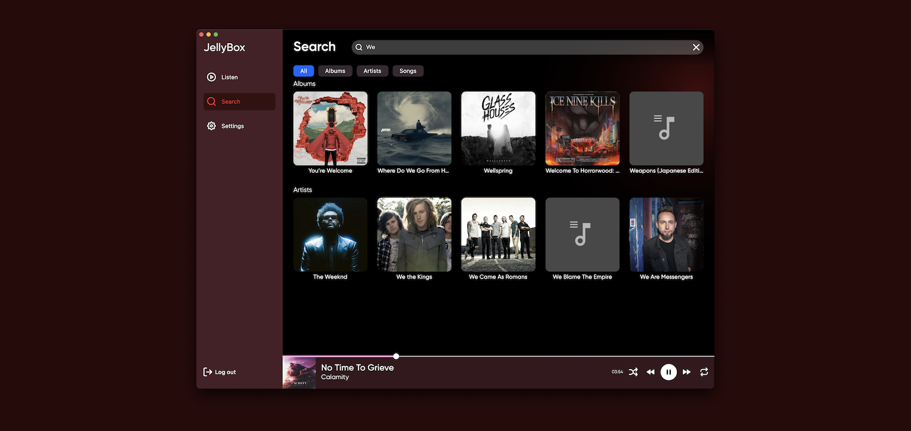

# JellyBox - Music player for Jellyfin

### Description
This is unofficial **audio** client for jellyfin app. For now macos and ios only. Expect any kind of crashes, issues and generally its good if it even runs.

## IOS/Macos

### Testing
In order to join test you need to use testflight app(official Apple's way of testing apps). You can join testing here - [Test Flight](https://testflight.apple.com/join/LVj8KwAq)
Current version supports both platforms - iOS and MacOS

## Android

While it can already be built and launched, I havent uploaded it to google play yet. This is something I plan to do soon.

## Screenshots

## Development

To run the app you need to have flutter cli installed + simulator(if you intend top run it on mobile).

* Install dependencies `flutter pub get`
* Run the app `flutter run` and then select target
* Once you're happy with your code submit a PR

