<div align="center">


# JellyBox

**The best native music player for your Jellyfin, Emby or Navidrome server - on macOS, Windows, Linux, iOS and Android, with Apple CarPlay and Android Auto.**

[](https://jellyfin.org)
[](https://emby.media)
[](https://www.navidrome.org)

[](https://github.com/avdept/JellyBoxPlayer/actions)
[](https://github.com/avdept/JellyBoxPlayer/releases/latest)
[](https://github.com/avdept/JellyBoxPlayer/releases)
[](./LICENSE)
[](https://github.com/avdept/JellyBoxPlayer/stargazers)
[](https://x.com/_avdept)
[](https://www.buymeacoffee.com/avdept)

[Download](#download) · [Screenshots](#screenshots) · [Features](#features) · [Development](#development)

</div>

---

JellyBox is an unofficial, audio-only client for [Jellyfin](https://jellyfin.org), [Emby](https://emby.media) and [Navidrome](https://www.navidrome.org) (any OpenSubsonic-compatible server can be tried, but only Navidrome is tested). It focuses on doing one thing well: making your own music library feel like a modern streaming app - fast browsing, offline downloads, lyrics, and artwork-driven theming - with a UI built for each platform rather than a single stretched layout.

> [!IMPORTANT]
> JellyBox is a client, not a server. You need access to a running Jellyfin, Emby or Navidrome server with a music library on it.

## Download

| Platform | Format | |
|---|---|---|
| **iOS / iPadOS / macOS**  | App Store | [](https://apps.apple.com/us/app/jellybox-player/id6469732117) |
| **macOS** | `.dmg` (signed & notarized) | [Latest release](https://github.com/avdept/JellyBoxPlayer/releases/latest) |
| **Windows** | Installer `.exe` or portable `.zip` | [Latest release](https://github.com/avdept/JellyBoxPlayer/releases/latest) |
| **Linux** | `.AppImage`, `.deb`, `.rpm` or `.tar.gz` bundle (x64 & arm64) | [Latest release](https://github.com/avdept/JellyBoxPlayer/releases/latest) |
| **Android** | Google Play | [](https://play.google.com/store/apps/details?id=com.prodigytech.jellybox) |
| **Android** | `.apk` (sideload) | [Latest release](https://github.com/avdept/JellyBoxPlayer/releases/latest) |

## Screenshots

### Desktop

<div align="center">
  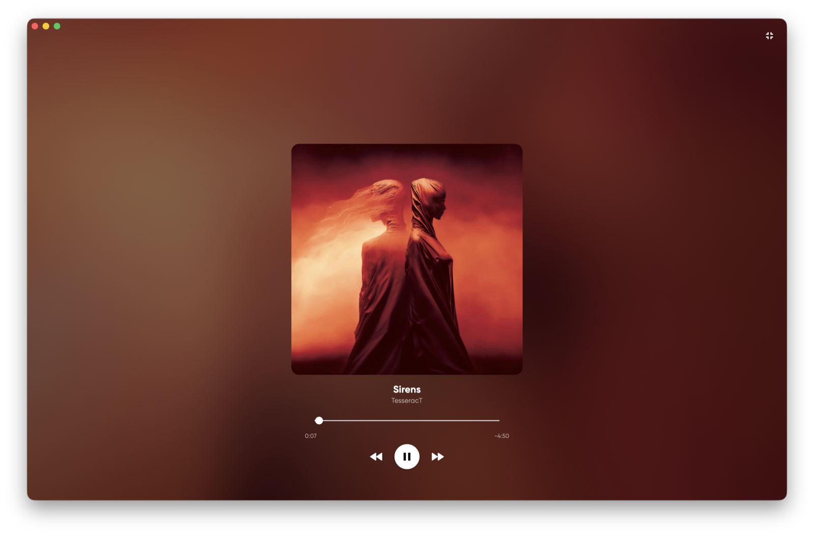
  <p><b>Studio Mode</b> - full-screen animated mode made for aesthetic</p>
</div>

<table>
  <tr>
    <td width="50%">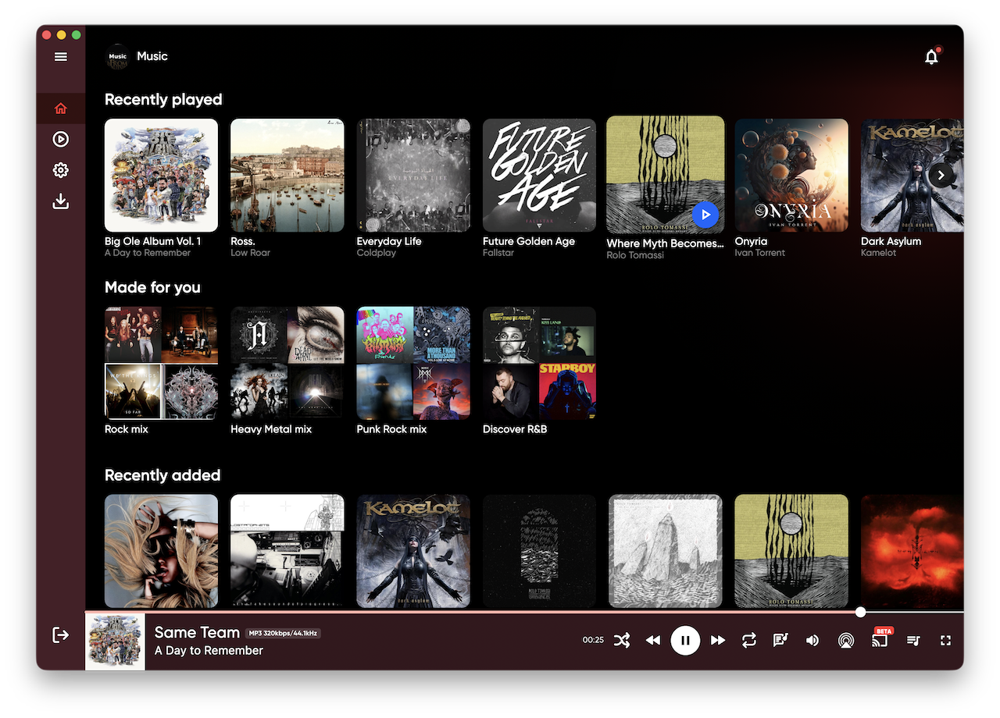</td>
    <td width="50%">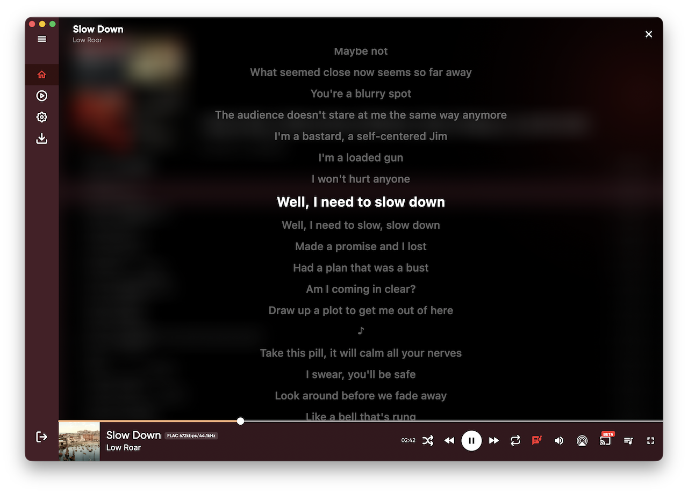</td>
  </tr>
  <tr>
    <td align="center"><b>Home</b></td>
    <td align="center"><b>Time-synced lyrics</b></td>
  </tr>
</table>

<details>
<summary><b>More screenshots</b> - songs, search, albums, artists, downloads</summary>
<br>

<table>
  <tr>
    <td width="50%">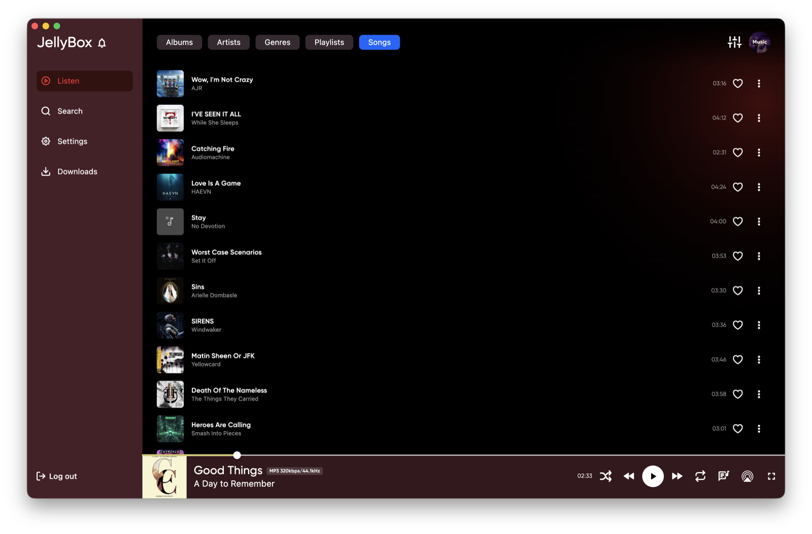</td>
    <td width="50%">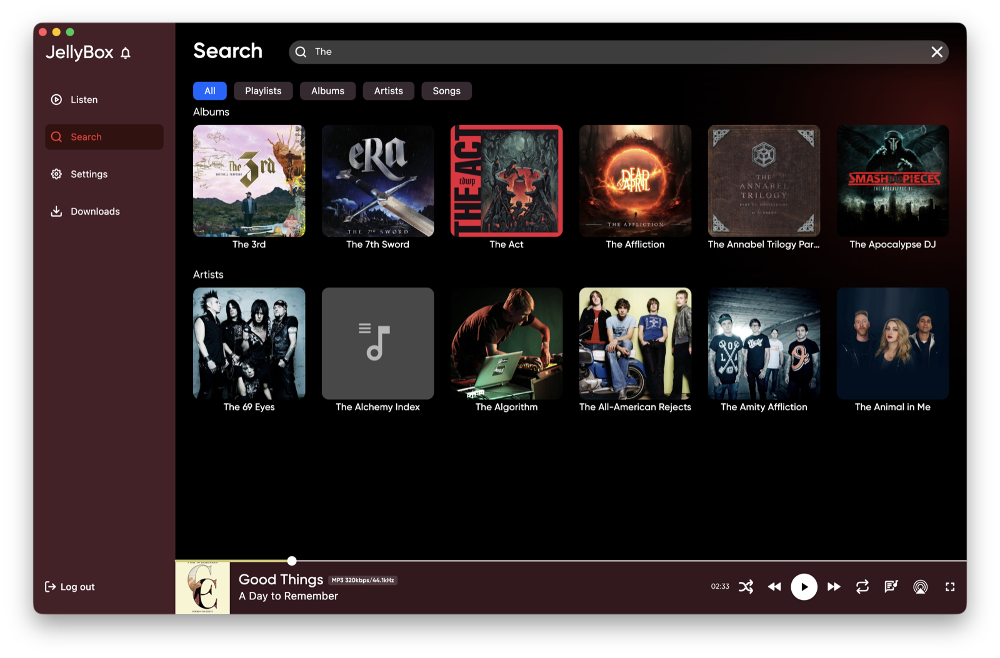</td>
  </tr>
  <tr>
    <td align="center"><b>Songs</b></td>
    <td align="center"><b>Search</b></td>
  </tr>
  <tr>
    <td width="50%">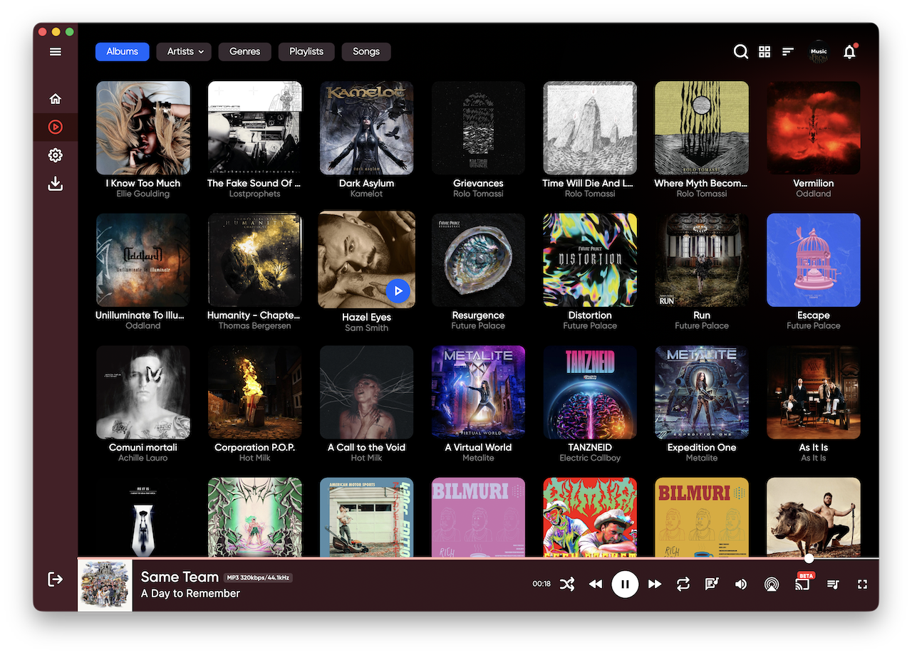</td>
    <td width="50%">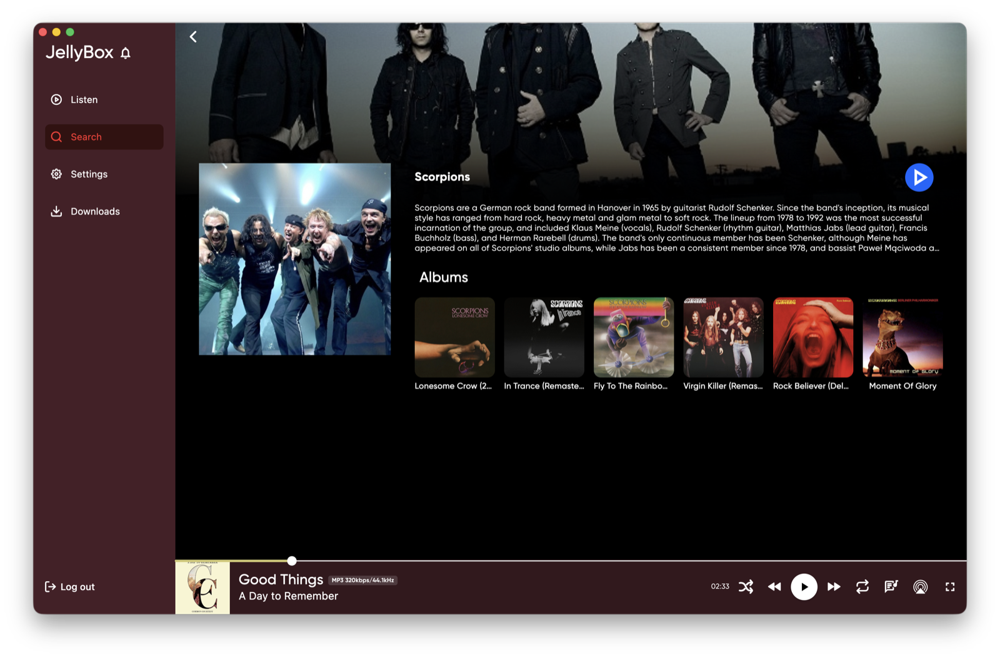</td>
  </tr>
  <tr>
    <td align="center"><b>Albums</b></td>
    <td align="center"><b>Artist</b></td>
  </tr>
  <tr>
    <td width="50%">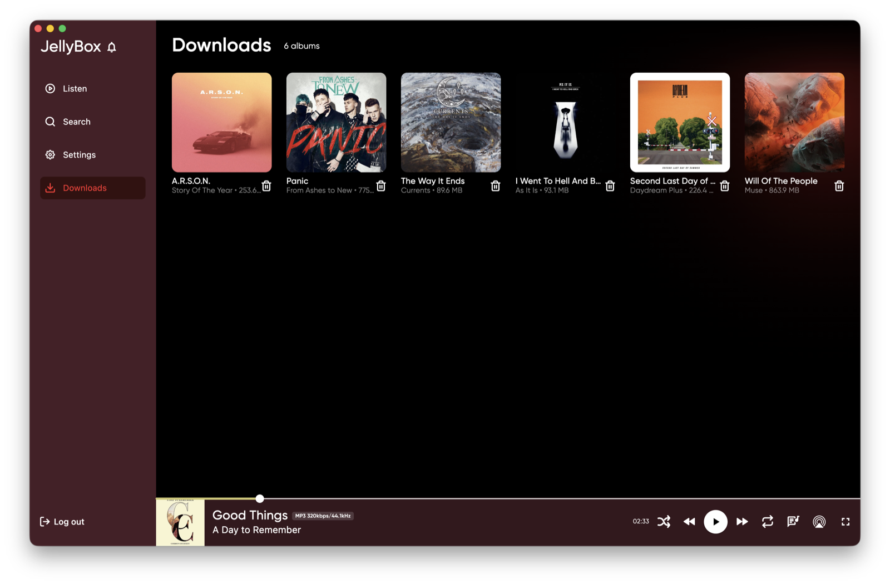</td>
    <td width="50%"></td>
  </tr>
  <tr>
    <td align="center"><b>Downloads</b></td>
    <td></td>
  </tr>
</table>

</details>

### Mobile

<table>
  <tr>
    <td width="20%">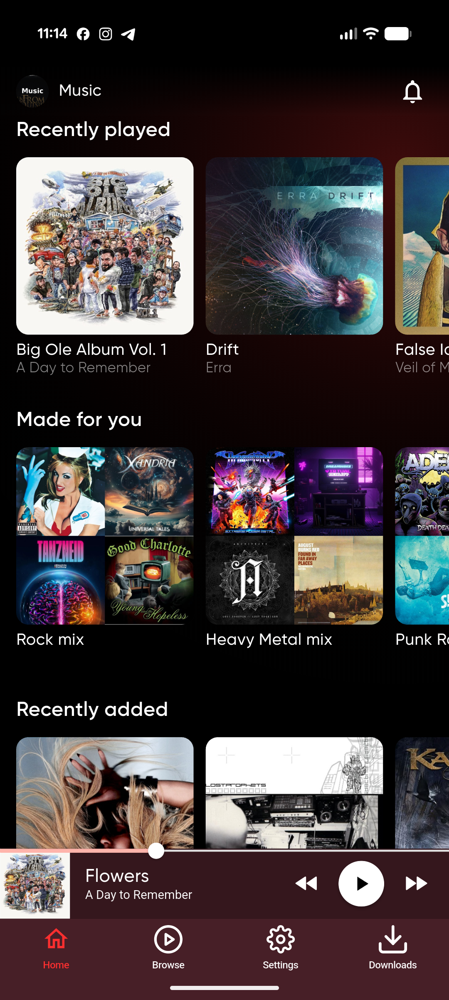</td>
    <td width="20%">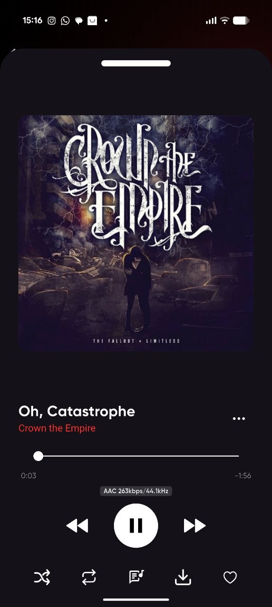</td>
    <td width="20%">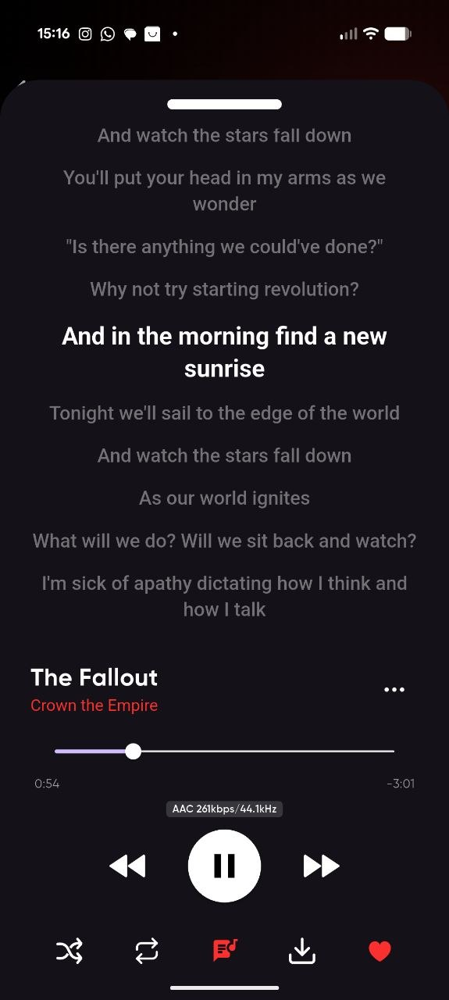</td>
    <td width="20%">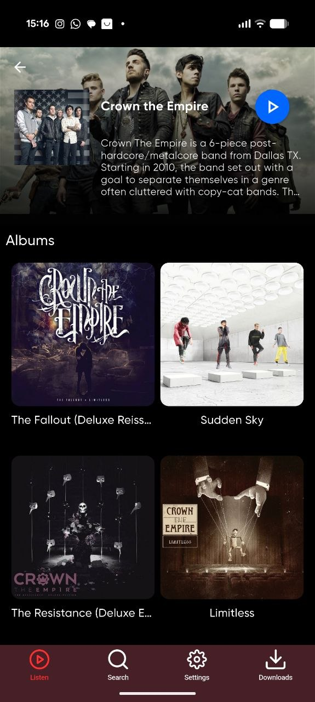</td>
    <td width="20%">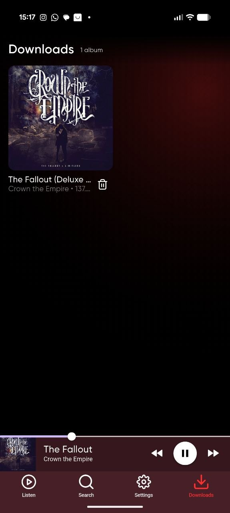</td>
  </tr>
  <tr>
    <td align="center"><b>Home</b></td>
    <td align="center"><b>Now playing</b></td>
    <td align="center"><b>Lyrics</b></td>
    <td align="center"><b>Artist</b></td>
    <td align="center"><b>Downloads</b></td>
  </tr>
</table>

<div align="center">
  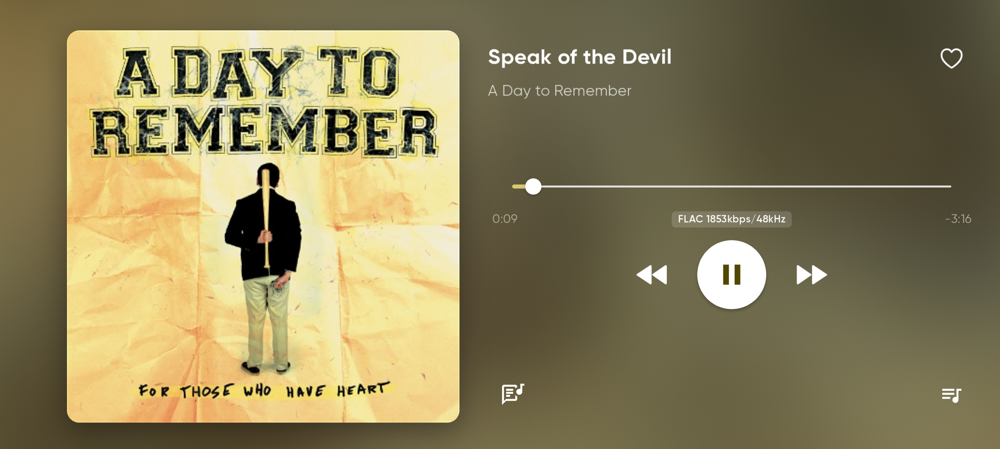
  <p><b>Landscape now playing</b> - rotate your phone for a wide player layout</p>
</div>

## Features

**Library & browsing**
- [x] Connect to Jellyfin, Emby or Navidrome (Subsonic API) servers, and switch between them without signing out
- [x] Jellyfin Quick Connect - sign in from your phone or desktop without typing a password
- [x] Browse albums, artists, genres, playlists and songs across multiple music libraries
- [x] Search everything at once, or filter to playlists, albums, artists or songs
- [x] Artist pages with biography and full discography
- [x] Favourite tracks, synced back to your server
- [x] Create playlists and add tracks to them from anywhere in the app
- [x] Genre mixes on the home page, built from the genres you actually play - see
  [Normalizing your music genres](./docs/normalizing-genres.md) if your genre tags are messy
- [x] Home page with recently played, recently added and personalised mixes

**Playback**
- [x] Playback memory - app remembers your queue and playback position between restarts
- [x] Time-synced lyrics overlay
- [x] Queue management with shuffle, repeat and a randomised "surprise me" queue
- [x] Per-connection streaming profiles with automatic transcoding when a codec isn't supported natively
- [x] Audio quality badge, so you always know whether you're getting the original file
- [x] Landscape now-playing layout on phones
- [x] ListenBrainz scrobbling - listens and now-playing go to your ListenBrainz account - see [ListenBrainz](./docs/listenbrainz.md)

**Offline**
- [x] Download albums and tracks for offline listening
- [x] Full offline mode - access to your downloaded tracks even if you're on plane.

**Look & feel**
- [x] Colour scheme generated from the current album artwork
- [x] Studio Mode - a full screen animated mode for aesthetic feel(see screenshots)

**Desktop & system integration**
- [x] Media keys and global keyboard shortcuts
- [x] MPRIS support on Linux (works with GNOME/KDE media widgets and `playerctl`)
- [x] Windows media overlay - now playing with artwork and transport controls in the system media popup, plus media key support
- [x] AirPlay and system output routing on macOS and iOS
- [x] Cast to DLNA / UPnP renderers (smart TVs, network speakers and receivers)
- [x] Lock screen and notification controls on iOS and Android
- [x] In-app changelog, so you can see what landed in each release
- [x] Apple CarPlay - currently in beta stage.
- [x] Android Auto - currently in beta stage.

## Platform notes

### macOS - media keys

macOS does not let an app read media keys without permission. On first use JellyBox will point you at **System Settings → Privacy & Security → Accessibility**; enable **JellyBox** there. If it isn't in the list, add it with the **+** button.

### Windows

The installer is unsigned, so SmartScreen will warn on first run - choose **More info → Run anyway**. The portable zip has no installer and can be run from anywhere.

### Android

Install from [Google Play](https://play.google.com/store/apps/details?id=com.prodigytech.jellybox), or sideload the APK from the [releases page](https://github.com/avdept/JellyBoxPlayer/releases). For the APK you'll need to allow installs from your browser or file manager.

### Linux

The release bundle expects a few shared libraries. On Debian/Ubuntu:

```bash
sudo apt-get install libmpv-dev mpv libsecret-1-dev libsqlite3-dev libjsoncpp-dev libcurl4-openssl-dev libdbus-1-dev
```

Note: Recently I bundled libs with app, but I need more folks to actually test it on different distros.

## Development

**Prerequisites** - [Flutter](https://docs.flutter.dev/get-started/install) with Dart SDK 3.8 or newer, plus the toolchain for whichever platform you're targeting (Xcode, Android Studio, or the Linux packages above).

```bash
git clone https://github.com/avdept/JellyBoxPlayer.git
cd JellyBoxPlayer

flutter pub get
dart run build_runner build --delete-conflicting-outputs   # freezed, json_serializable, retrofit
flutter run                                                # then pick a target device
```

Run the tests with `flutter test`, and the analyzer with `flutter analyze` - CI runs both on every push.

Codegen is needed whenever you touch a model, DTO or API client; those `*.g.dart` and `*.freezed.dart` files are generated, not hand-edited.


## Contributing

Bug reports, feature requests and pull requests are all welcome - see [CONTRIBUTING.md](./CONTRIBUTING.md) for the workflow.

## License

[GNU AGPL-3.0](./LICENSE) © ProdigyTech Inc.
